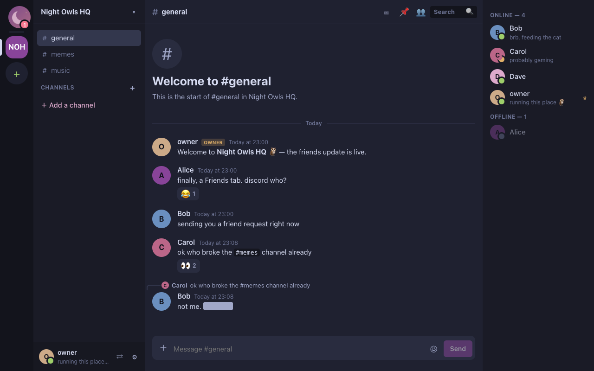
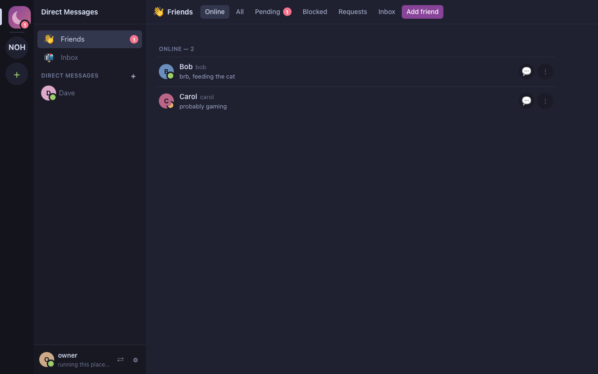
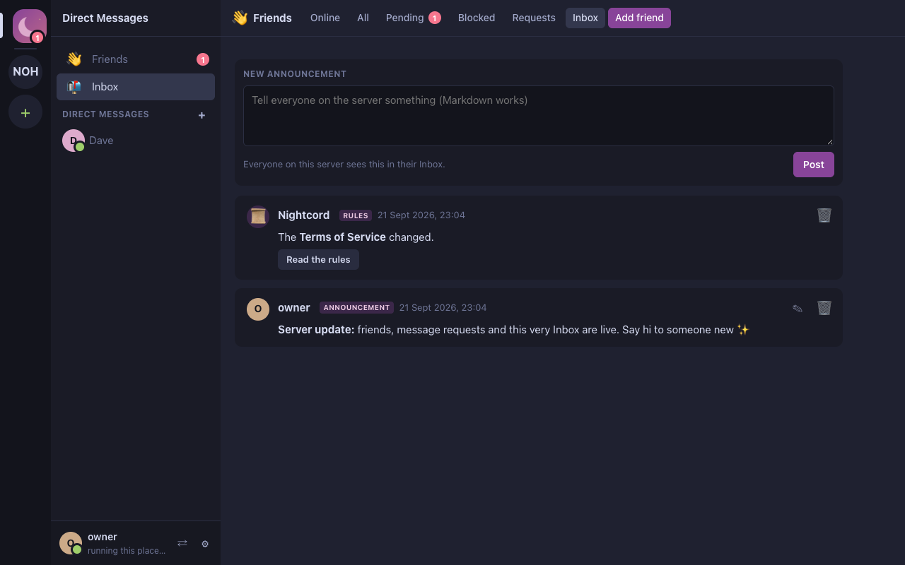

# Nightcord

A web-based messaging app, built for selfhosting. A parody of Discord.

[Website](https://nightcord.etangaming.xyz/) · [Open the client](https://nightcord.etangaming.xyz/app/) · [Try the preview](https://nightcord.etangaming.xyz/app/?preview) · [Protocol spec](docs/PROTOCOL.md)

> [!WARNING]
> **This is vibecoded by Claude, have fun :)**
> It works and it has tests, but nobody has audited it. Don't put anything on it you'd be upset to lose or leak.

> [!WARNING]
> **Whoever runs a server can see your IP address and read everything on it.** Only join servers run by people you
> trust. The client warns about this before it connects anywhere new.
>
> **Link previews are fetched by the server, not by you.** When someone posts a link, the server requests that page
> and proxies its preview images and videos, so the site sees the *server's* address and never the readers'. The one
> exception: pressing play on a YouTube preview loads YouTube's player (from `youtube-nocookie.com`) in your browser.
> Server owners who'd rather not make outbound requests at all can turn previews off with `link_embeds`.

> [!NOTE]
> Nightcord is built for **personal use**: a few friends, a big friend group at most. It's one small Python process
> and one SQLite file, not a public service that scales to thousands of strangers. It isn't affiliated with Discord.

## Features

### Chat
- A **Home page** that says which server you're on (hidden, name or address, your pick), how many friends are online,
  how many servers you're in and how long Nightcord's been open, plus an **About this server** page the owner writes
- Guilds with text channels, categories, topics, slowmode and (placeholder) voice channels
- Markdown (headings, lists, subtext, masked links, `<t:…>` timestamps, `#channel` chips), replies, reactions,
  pins, edits, @mentions, typing indicators, unread badges synced across devices
- **Link previews that look like Discord's**, built by the server: provider, author, title, description and a big
  image or a thumbnail. X/Twitter links go through fixupx so tweets show their text, media and stats, YouTube links
  show the video's title and play inline when you press play, and Tenor/Giphy/image links show up as plain GIFs and
  pictures. Everything goes through the server's proxy, so reading a channel never tells the linked site who you
  are, and previews are cached so a restart doesn't refetch them. A leaving-site dialog names the real host before
  any link opens.
- **Polls** with multiple choice, a countdown and visible voters, and **slash commands** — `/roll 2d6+3`, `/8ball`,
  `/coinflip` and `/choose` are rolled by the server so nobody can type a lucky result, while `/shrug`, `/me`,
  `/spoiler`, `/remind` and friends stay in the client
- **Forward** a message anywhere, **Save** one for later in a private list, and **Mark Unread** to come back to it.
  Every message has a right-click menu, and a Copy Link that opens in the app rather than a new tab.
- **On your phone**, long-press a message for a sheet of quick reactions and actions (with a little buzz on
  Android), swipe a message left to reply, swipe right for the channel list and in from the right edge for members
- Short timestamps like Discord's: *Today at 3:18pm*, *Yesterday at 3:00am*, *13/11/26 at 12:00pm*. Pick
  dd/mm/yy, mm/dd/yy or yy/mm/dd and 12- or 24-hour time in *Settings → Appearance*.
- **Real URLs**: the address bar says where you are (`/app/servers/…/…`, `/app/dms/…`, `/app/friends/pending`,
  `/app/settings/appearance`), so Back and Forward work and you can bookmark a channel
- **Twemoji**, the emoji Discord uses, on every OS (country flags on Windows too), with every emoji in the picker
  under Discord's names: `:thumbsup:`, `:+1:`, `:slight_smile:`, `:flag_us:`. Buttons use proper icons, not emoji.
- A formatting toolbar over the message box, and keyboard shortcuts with a cheat sheet on Ctrl+/
- Search with `from:`, `in:`, `has:` and `pinned:` filters; Ctrl/Cmd+K quick switcher
- File uploads with inline images and video
- Custom emoji and stickers per guild, usable **everywhere by everyone**. No Nitro required, or even possible.

### People
- **Friends:** add people by exact username, accept or decline requests, block people
- **Message requests:** strangers get one message that waits in your Message Requests until you say yes. You pick
  who can DM you: everyone, friends plus requests (the default), or friends only.
- 1:1 and group DMs. Only your friends can add you to a group.
- **Inbox:** announcements from the server owner, plus automatic notices when the rules change
- **Account switcher:** keep several accounts on several servers and hop between them
- Profiles with avatars, banners, gradient profile colours, bios and custom statuses. Your status clears itself
  after an hour (or whenever you like) and nobody sees it while you're invisible.
- **Private notes** on people, readable only by you
- **Badges:** the server owner uploads their own and hands them out, plus a blue Verified check that's built in

### Running a server
- Roles and permissions with per-channel overrides, kicks, bans, timeouts and audit logs
- Server staff (admins and moderators), account approval, IP and device bans
- Custom badges and a Verified badge you can give to anyone, shown next to their name or just on their profile
- Terms of Service and Privacy Policy pages that people accept before joining
- Server-wide switches for who can customise their profile, whether user search exists, and more
- A server description, shown on the login screen, the About page and the page at your server's address
- An **Accounts** list you can sort and filter (online now, staff, muted, seen in the last week, gone quiet for a
  month...) with "last seen" as a date, a time, "3 hours ago" or both
- A **Data** tab with a chart of what your storage goes on, and buttons to clear the preview cache, delete unused
  uploads and compact the database
- One-command backups, and an automatic copy of the database before every upgrade

## Screenshots

| Guilds | Friends | Inbox |
|---|---|---|
|  |  |  |

## Quickstart

To **join** a server, open [the client](https://nightcord.etangaming.xyz/app/), type in the server's
address (`host:port`) and make an account. That's it. Registering asks for the password twice, and
the client can reconnect to your last server on startup (a checkbox on the server select screen,
also in *Settings → Appearance*; switch it off if you'd rather pick each time).

To **look around** first, [try the preview](https://nightcord.etangaming.xyz/app/?preview) (or press
*Try a preview* on the server select screen). It's the whole client on a pretend server with sample
people, running entirely in your browser tab: pick owner or member, send messages, make a guild, poke
at the owner settings. Nothing you do is sent anywhere, your real settings and saved servers aren't
touched, and a reload puts it all back. With *Simulated activity* on, the sample people chat, react,
come and go and answer you. One of them has a song they really want you to hear.

To **host** one, keep reading.

### Standalone client

Prefer not to depend on the hosted client being up? Grab `nightcord-standalone.html` from the
[latest release](../../releases/latest) — one self-contained file with everything (JS, CSS, the
logo, sounds and UI text) inlined. Double-click it to open it from disk and connect to any server,
same as the hosted client. The server you connect to needs `allow_file_origin` turned on (see
below), since a page opened from disk sends `Origin: null`, which servers reject by default. The
preview isn't in the standalone file; use the hosted client for that.

On load, the standalone client checks GitHub's release API (`api.github.com`) once to see if a newer
standalone build exists, and shows a big banner on the server select and login screens (and a dismissible notice in the Inbox) if so — this is the only network
request the client ever makes outside the server you connect to. Turn it off in *Settings → Local
Options*.

## Selfhosting

### You will need
- Python 3.11 or newer
- A machine that stays on (a spare PC, a Raspberry Pi, a cheap VPS)
- A port your friends can reach (8765 by default), or a tunnel or reverse proxy

### Steps
1. Get the server running:
   ```sh
   cd server
   python -m venv .venv && . .venv/bin/activate
   pip install -r requirements.txt
   cp nightcord.example.toml nightcord.toml   # set server_name, public_hostnames, allowed_origins
   python nightcord_server.py --config nightcord.toml
   ```
2. The first start prints a **setup code** and makes a self-signed TLS certificate in `data/`.
3. Open the client, connect to your server and enter the setup code. You'll pick the owner account, the server name
   and who may create accounts and guilds.
4. Send your friends the link. `https://nightcord.etangaming.xyz/app/?server=your-host:8765` opens the
   client already pointed at your server.

### Updating
Pull the new code and restart the server. The database upgrades itself on start, and saves a copy of the old one to
`backups/pre-migrate-v<old>-to-v<new>-<date>.db` first (the newest three are kept), so a bad upgrade can be rolled
back by putting that file back as `data/nightcord.db`. A full [backup](#backups) beforehand never hurts. (Databases from the very first commit, protocol 0.2, can't be upgraded; the server says so and won't start.)

### Certificates
The hosted client runs over https, so it has to use `wss://`. Browsers reject self-signed certificates until you
accept them once. Each person opens `https://your-host:8765/`, accepts the warning, then goes back and connects. The
client shows this link when a connection fails. A real certificate (or Cloudflare Tunnel, Caddy and so on) skips this
step.

### Allowed origins
The server only accepts browsers from the origins in `allowed_origins`. Add wherever the client is hosted, e.g.
`https://etangaming123.github.io`. Behind a reverse proxy, set `trust_proxy = true` so IP bans see real addresses.
Leave it off otherwise, or anyone can fake theirs.

To let people connect with the [standalone `.html` client](#standalone-client) instead, set
`allow_file_origin = true` in `nightcord.toml` (or start with `--allow-local-client`). It's off by
default: a page opened from disk sends `Origin: null`, which is otherwise indistinguishable from
other things that send no useful origin, so only turn it on if you're fine with that file connecting.

### Hosting the client yourself
Fork this repo, then go to *Settings → Pages → Source: GitHub Actions*. Every push to `main` publishes the homepage
at `/` and the client at `/app/`. The client is plain files with no build step, so any static host works too:
serve `site/` at the root and `client/` at `/app/`.

> [!NOTE]
> Deep links like `/app/servers/…` don't exist as files. GitHub Pages serves `site/404.html` for them, which bounces
> to `/app/?route=…` and the client puts the address back. On another host, point unknown paths under `/app/` at that
> 404 page (or just at `/app/?route=<the rest>`); without it, links and reloads land on `/app/` instead.

## Customising

Everything here is a plain file you can replace. Keep the name and format.

| What | Where |
|---|---|
| Logo (favicon, home button, homepage) | `client/assets/logo.png`, a square PNG (512×512 recommended) |
| Message sound | `client/assets/sounds/message.wav` (also used for friend requests, message requests and announcements) |
| Mention sound | `client/assets/sounds/mention.wav` |
| Voice join / leave | `client/assets/sounds/voice-join.wav`, `voice-leave.wav` |
| Every piece of UI text | `client/lang/en/**/*.json` |
| Homepage | `site/index.html`, `site/style.css` |

`python tools/gen_assets.py` regenerates the default logo and sounds. It overwrites your replacements, so only run
it to get the defaults back.

## Server admin

Most of this lives in the client under **User settings (⚙) → Server admin**. The same things work from the command
line, even while the server is running:

```sh
python nightcord_server.py pending list|approve|reject <username>   # account requests
python nightcord_server.py users list|disable|enable <username>
python nightcord_server.py staff list|set <username> admin|moderator|none
python nightcord_server.py perks list|add|remove <username>         # customisation allow-list
python nightcord_server.py ipban list|add|remove <ip-or-cidr>
python nightcord_server.py guilds                                   # every guild and its ID
python nightcord_server.py owner reset-password                     # locked out? prints a new password
python nightcord_server.py config show
python nightcord_server.py config set <key> <value>
```

Settings you can `config set`:

| Key | Values |
|---|---|
| `server_name` | any name |
| `server_description` | Markdown, up to 2000 characters. Write `\n` for a line break. |
| `account_creation` | `on`, `request` (staff approve), `off` |
| `guild_creation` | `on`, `off` (owner only) |
| `guild_list_visible` | `true`, `false` |
| `max_upload_mb` | 1–1024 |
| `voice_enabled` | `true`, `false` (voice has no audio yet) |
| `customization_mode` | `on`, `allowlist`, `off` |
| `user_search` | `off` (default: add friends by exact username), `staff`, `on` |
| `announcements_admins` | `true`, `false` (the owner can always post) |
| `link_embeds` | `true`, `false`. Fetch pages people link to and show a preview. Off means the server makes no outbound requests for messages. |
| `fx_links` | `true`, `false`. Read X/Twitter links through fixupx.com for proper tweet previews. |
| `max_accounts_per_client` | 0 (no limit) to 20. A courtesy limit for the account switcher, not enforced. |

## Backups

```sh
python nightcord_server.py backup            # writes backups/nightcord-backup-<date>.zip
python nightcord_server.py backup --out /somewhere/safe
```

The zip has a consistent snapshot of the database plus uploads, emoji, avatars and the rules pages. It's safe to run
while the server is up. To restore, stop the server, unzip into an empty `data/` folder and start it again. TLS keys
aren't included; the server makes a new certificate.

## Development

```sh
# terminal 1: the server, without TLS
python server/nightcord_server.py --no-tls --port 8765 --data-dir data-dev

# terminal 2: homepage at / and client at /app/
python tools/localhost.py
```

Open <http://127.0.0.1:8000/app/?server=http://localhost:8765>.

Tests:
```sh
cd server && pip install -r requirements-dev.txt && pytest
cd client && npm test          # markdown tokenizer + a check that every UI string exists
```

[`docs/PROTOCOL.md`](docs/PROTOCOL.md) is the source of truth for the wire protocol. `client/js/protocol.js` is
generated from `server/nightcord/protocol.py` by `python server/tools/gen_client_protocol.py`, and
`server/tests/test_protocol_sync.py` fails if the three disagree.

## Work in progress

Things that might happen one day:
- Voice and video that actually carry audio (voice channels are presence-only placeholders today)

## License

[MIT](LICENSE). Nightcord is a parody and isn't affiliated with or endorsed by Discord.

Bundled bits with their own licences (details in [LICENSE](LICENSE)): emoji from [Twemoji](https://github.com/mozilla/twemoji-colr)
(graphics CC-BY 4.0), icons from [Lucide](https://lucide.dev) (ISC), and emoji names from
[emojibase](https://emojibase.dev) (MIT).
